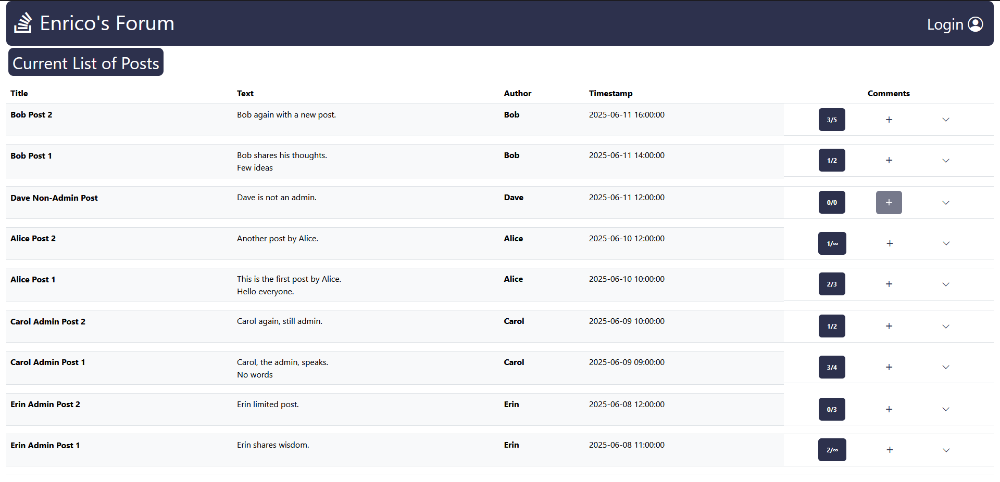
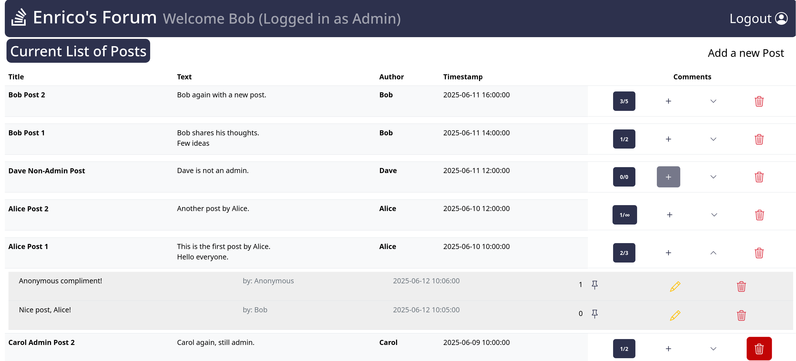
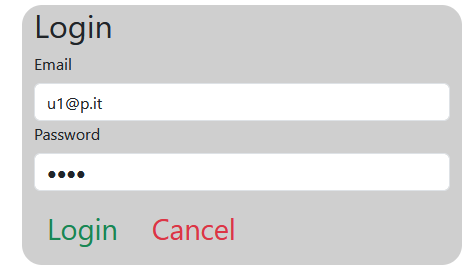
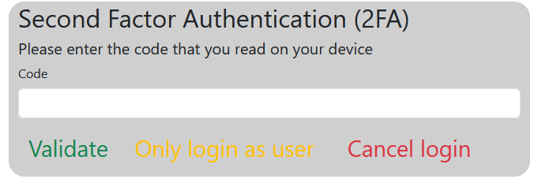
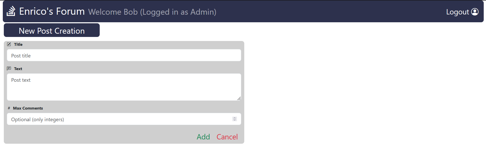
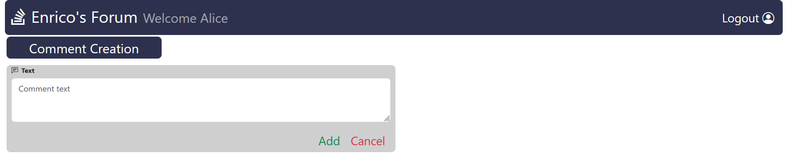

# Exam #1: "Forum"

Design and implementation of a web application to manage a forum where users can write posts and others can insert comments related to the posts. The application implements the following specifications. 
A post is an item composed of a unique title (among all posts), an author, a non-empty text, an optional maximum number of comments (including zero) that can be appended to the post, and a publication timestamp. Additionally, a list of zero or more comments is associated with a post.
A comment is composed of a non-empty text, a publication timestamp, and, optionally, an associated author. Comments without an author are considered “anonymous comments”.
The text of both posts and comments can be multiline, i.e., newlines can be inserted when entering the text and such formatting (newlines) must be kept when visualizing such text. 
When visualizing the list of posts and/or the list of comments associated with a post, in any view, they must always be listed in chronological order, from the most recent to the less recent one, according to the timestamp, which must be shown in the numeric format year-month-day hour:min:sec. Timestamps refer to the time of the permanent creation in the system (e.g., the info is entered in the database). No handling of time zones is required.
Initially, a generic (authenticated or not) visitor of the website can only see, regardless of its authentication status, a list of all posts showing their title, author, text, timestamp, the number of comments (of any type) currently associated with the post and the maximum allowed one for each post, but not the list of comments appended to each post, except for the anonymous comments. 
Anybody (authenticated or not) can append a comment to a post. Comments of non authenticated users will be anonymous comments. Anonymous comments count towards the limit of maximum comments. Once inserted, anonymous comments can be manipulated only when explicitly specified in the following.
An authenticated user can:
- See the list of posts as the generic visitor of the website, but in addition the user can see the list of appended comments. For each comment, the user can see the text, timestamp, author, and also the total number of “interesting” flags received by all users for that comment (see next point). The user can also see if it has previously marked such a comment as “interesting” for his/her, e.g, showing a flag icon next to the comment;
- Mark any existing comment, even authored by anybody else, as interesting/not interesting for his/her. Note that the interesting flag information is private and it has to be shown only to the user that inserted it;
- Add posts by specifying their title, text and the (optional) maximum number of comments . Other information will automatically be set by the system upon confirmation: the timestamp, and the author (the logged-in user). A newly created post starts with an empty list of comments in any case. When adding a post, the authenticated user is considered the author by the system;
- Add comments to any post, regardless of the post author. When adding a comment, the authenticated user is considered the author of the comment. Thus, it cannot add an anonymous comment. Other information such as the timestamp is to be automatically set by the system upon confirmation;
- Edit the text of comments for which they are the authors. Edit operations do not modify the publication timestamp and have no impact on the interesting mark. Text of posts in not required to be edited after creation time;
- Delete the comments and posts for which he/she is the author. When deleting posts, all associated comments are removed from the system, regardless of the author, including anonymous ones.

A special category of users, named administrators, can, in addition to the previous operations, also delete anybody’s posts or comments, including anonymous ones, and edit the text of any comment, including anonymous ones. Such users, to be able to act as administrators, must authenticate using the 2FA procedure with a TOTP. Such a category of users can also choose to authenticate without using the 2FA procedure, thus acting as authenticated users with username/password only.

## Student: DI STASIO ENRICO 
## React Client Application Routes

- Route `/`: Home page which shows all the posts, the anonymous comments and the non-anonymous ones when logged-in.
- Route `/add/post`: Form which allows to create a new post by choosing title, text and optionally maximum number of comments
- Route `/add/:postId/comment`: Form which allows to create a new comment to a post by choosing the text
- Route `/edit/:postId/:commentId`: Form which allows to edit a comment by changing its text
- Route `/login`: Form which allows to login using username (email) and password
- Route `/totp`: Form which appears after a user with the ability to be an admin logs-in and allows him or her to become admin by inserting a TOTP

## API Server

### Posts and Comments Management
- GET `/api/posts`
  * Description: Get all the posts.
  * Request body: _None_
  * Response: `200 OK` (success) or `404 Not Found` (no posts found) or `500 Internal Server Error` (generic error).
  * Response body: An array of objects, each describing a post.
```
[
  {
    "id": 1,
    "title": "Alice Post 1",
    "authorId": 1,
    "author": "Alice",
    "text": "This is the first post by Alice.\nHello everyone.",
    "comment_count": 2,
    "max_comments": 3,
    "timestamp": "2025-06-10 10:00:00"
  },
...]
```
- GET `/api/comments/anon`
  * Description: Get the anonymous comments.
  * Request body: _None_
  * Response: `200 OK` (success) or `404 Not Found` or `500 Internal Server Error` (generic error).
  * Response body: An array of objects, each describing a post.
```
[
  {
    "id": 2,
    "postId": 1,
    "authorId": null,
    "author": "Anonymous",
    "text": "Anonymous compliment!",
    "num_interesting": 0,
    "isInteresting": null,
    "timestamp": "2025-06-12 10:06:00"
  },
...]
```
- GET `/api/comments`
  * Description: Get all the comments.
  * Request body: _None_
  * Response: `200 OK` (success) or `401 Not Authorized` or `404 Not Found` or `500 Internal Server Error` (generic error). If the request is not valid, `422 Unprocessable Entity` (validation error).
  * Response body: An array of objects, each describing a post.
```
  [
  {
    "id": 1,
    "postId": 1,
    "authorId": 2,
    "author": "Bob",
    "text": "Nice post, Alice!",
    "num_interesting": 0,
    "isInteresting": null,
    "timestamp": "2025-06-12 10:05:00"
  },
...]
```
- DELETE `/api/posts/<id>/delete`
  * Description: Deletes the post with a specific id `<id>`. May be performed only by the owner of the post or by an admin.
  * Request parameter: The postID `<id>`
  * Response: `200 OK` (success) or `401 Not Authorized` or `404 Not Found` (wrong id) or `500 Internal Server Error` (generic error). If the request is not valid, `422 Unprocessable Entity` (validation error).
  * Response body: _None_

- DELETE `/api/comments/<id>/delete`
  * Description: Deletes the comment with a specific id `<id>`. May be performed only by the owner of the comment or by an admin.
  * Request parameter: The commentID `<id>`
  * Response: `200 OK` (success) or `401 Not Authorized` or `404 Not Found` (wrong id) or `500 Internal Server Error` (generic error). If the request is not valid, `422 Unprocessable Entity` (validation error).
  * Response body: _None_

- POST `/api/posts/add`
  * Description: Adds a new post passed with body.
  * Request body: An object representing a post (Content-Type: `application/json`).
  ```
  {
      "title": "new title \n",
      "text": "this is a new text",
      "max_comments": "3"
  }
  ```
  * Response: `200 OK` (success) or `401 Not Authorized` or `500 Internal Server Error` (generic error or if a post with that title already exists). If the request is not valid, `422 Unprocessable Entity` (validation error).
  * Response body: _None_

- POST `/api/comments/add`
  * Description: Adds a new comment passed with body.
  * Request parameter: _None_
  * Request body: An object representing a comment (Content-Type: `application/json`).
  ```
  {
      "text": "this is a new comment text",
  }
  ```
  * Response: `200 OK` (success) or `404 Not Found` or `500 Internal Server Error` (generic error). If the request is not valid, `422 Unprocessable Entity` (validation error).
  * Response body: A message with the id of the added comment.

- PUT `/api/comments/<id>/edit`
  * Description: Edit an existing comment's text passed as body. May be performed only by the owner of the comment or by an admin.
  * Request parameter: The commentId `<id>` (also passed in body and then checked)
  * Request body: An object representing a comment (Content-Type: `application/json`).
  ```
  {
      "id": 5,
      "text": "this is text of an edited comment",
  }
  ```
  * Response: `200 OK` (success) or `401 Not Authorized` or `404 Not Found` or `500 Internal Server Error` (generic error). If the request is not valid, `422 Unprocessable Entity` (validation error  ).
  * Response body: _None_

- POST `/api/comments/<id>/interesting`
  * Description: Mark a comment as interesting.
  * Request parameter: The commentID `<id>`
  * Request body: _Null_
  * Response: `200 OK` (success) or `401 Not Authorized` or `404 Not Found` or `500 Internal Server Error` (generic error). If the request is not valid, `422 Unprocessable Entity` (validation error).
  * Response body: _None_

- POST `/api/comments/<id>/notInteresting`
  * Description: Un-mark a comment as interesting.
  * Request parameter: The commentID `<id>`
  * Request body: _Null_
  * Response: `200 OK` (success) or `401 Not Authorized` or `404 Not Found` or `500 Internal Server Error` (generic error). If the request is not valid, `422 Unprocessable Entity` (validation error).
  * Response body: _None_

### Users APIs
- POST `/api/sessions`
  * Description: Create a new session starting from given credentials.
  * Request body: An object with username and password
  ```
  {
    "username": "u1@p.com",
    "password": "pwd1"
  }
  ```
  * Response: `200 OK` (success) or `500 Internal Server Error` (generic error).
  * Response body: _None_

- POST `/api/login-totp`
  * Description: Create a session strating from a TOTP code
  * Request body: An object with the TOTP code
  ```
  {
    "code": "097620" 
  }
  ```
  * Response: `200 OK` (success) or `500 Internal Server Error` (generic error).
  * Response body:
  ```
  {
    "otp": "authorized"
  }
  ```

- DELETE `/api/sessions/current`
  * Description: Delete the current session.
  * Request body: _None_
  * Response: `200 OK` (success) or `500 Internal Server Error` (generic error).
  * Response body: _None_


- GET `/api/sessions/current`
  * Description: Verify if the given session is still valid and return the info about the logged-in user.
  * Request body: _None_ 
  * Response: `201 Created` (success) or `401 Unauthorized` (error).
  * Response body: An object with user information
  ```
  {
    "id": 1,
    "username": "u1@p.it",
    "name": "Alice",
    "canDoTotp": false,
    "isTotp": false
  }
  ```

## Database Tables
Two DB files: `forum.db` (original database) and `forum copy.db` (copy used for modifications and testing). SQL file `forum.sql` to recreate original database.
- Table `users` - contains the id (primary key), the email, the password hash, the salt and the TOTP secret (only for the admins) for all users.
- Table `posts` - contains the id (primary key), title, author_id, text, max number of comments (optional) and publication_timestamp of all the posts.
- Table `comments` - contains the id (primary key), post_id (foreign key referencing posts.id), author_id (if null the author is anonymous), text, number of interesting flags and publication_timestamp of all the comments.
- Table `interesting_flags` - contains the information regarding which user has marked which comment as interesting, userId (foreign key referencing users.id) and commentId (foreign key referencing comments.id) combination as a primary key.

## Main React Components

- `MyNavbar` (in `Navbar.jsx`): renders the navbar containing the login/logout button.
- `PostRoute` (in `PostList.jsx`): shows the button to add a new post and the list of current posts along with the comments to each post (every comment if logged-in otherwise only the anonymous ones). Wrapper for `PostsTable` and `CommentsTable`.
- `PostsTable` (in `PostList.jsx`): renders the tables that show the posts and comments. Also uses other minor components like `AddNewComment`, `DeletePost`.
- `CommentsTable` (in `PostList.jsx`): renders the tables that show the comments. Also uses other minor components like `EditComment`, `DeleteComment` and `Interesting`.
- `AddPost` (in `AddPost.jsx`): renders the form used to create a new post.
- `AddEditComment` (in `AddEditComment.jsx`): renders the form used to create a new comment or edit an existing one.
- `LoginForm` (in `AuthComponent.jsx`): renders the login form.
- `TotpForm` (in `TOTPComponent.jsx`): renders the TOTP form.

## Screenshot








## Users Credentials

| email      | name  | plain-text password  | Admin |
|------------|-------|----------------------|-------|
| u1@p.it    | Alice | pwd1                 | No    |
| u2@p.it    | Bob   | pwd2                 | Yes   |
| u3@p.it    | Carol | pwd3                 | No    |
| u4@p.it    | Dave  | pwd4                 | No    |
| u5@p.it    | Erin  | pwd5                 | Yes   |

### TOTP Secret: LXBSMDTMSP2I5XFXIYRGFVWSFI
